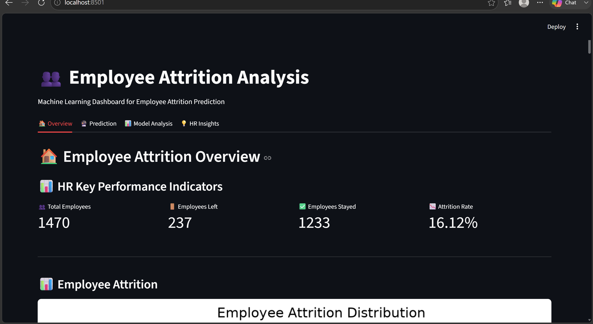
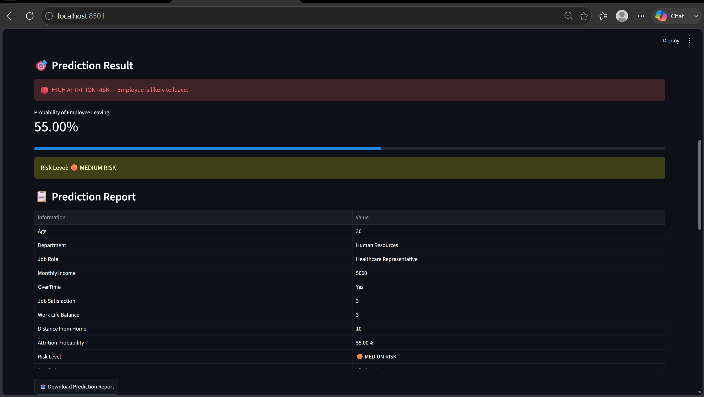
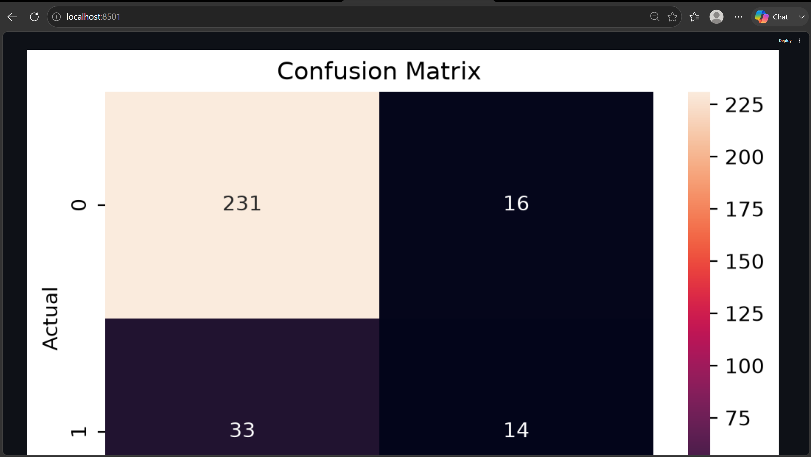

# Employee Attrition Analysis and Prediction System
## Project Overview
The Employee Attrition Analysis and Prediction System is a Machine Learning-based project developed using Python and Streamlit.
The system analyzes employee information and predicts the probability of employee attrition. It also provides risk classification, automatic HR insights, HR recommendations, and prediction reports.

## Objectives
- Analyze employee attrition patterns
- Perform data preprocessing and analysis
- Develop a Machine Learning model
- Predict employee attrition
- Calculate attrition probability
- Classify employees based on risk level
- Generate automatic HR insights
- Provide HR recommendations

## Technologies Used
- Python
- Pandas
- NumPy
- Scikit-learn
- Matplotlib
- Seaborn
- Streamlit

## Machine Learning Model
The project uses the Random Forest Classifier for employee attrition prediction.

## Model Performance
- Accuracy: 82.99%
- ROC-AUC: 0.792

## Features

- HR Key Performance Indicators
- Employee Attrition Prediction
- Attrition Probability
- Risk Classification
- Automatic HR Insights
- HR Recommendations
- Prediction Report
- CSV Download

## How to Run
Install the required libraries:

```bash
pip install -r requirements.txt

## Author
Meena Sree V T
B.Tech Information Technology
St. Joseph's Institute of Technology

## 📸 Project Screenshots

### 📊 Employee Attrition Dashboard


### 🔮 Employee Attrition Prediction


### 💡 HR Recommendations


### 📈 Model Performance - Confusion Matrix

